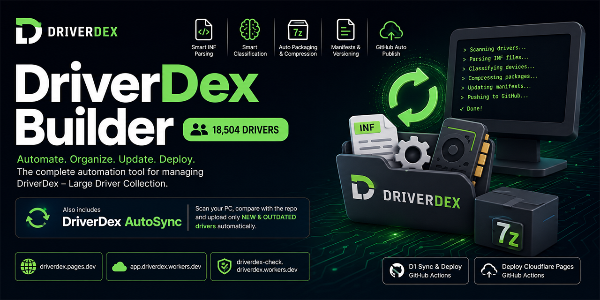

<!-- DRIVERDEX_DRIVER_BADGE_START -->

<!-- DRIVERDEX_DRIVER_BADGE_END -->

<div align="center">

# DriverDex

### Windows Driver Collection & Automation

**A community-driven project by [ArchTech BD](https://archtechbd.com/) for building, organizing, syncing, and deploying Windows drivers.**

<p>
  <a href="https://github.com/driverdex/driverdex">Repository</a> ·
  <a href="https://driverdex.pages.dev">Web</a> ·
  <a href="https://github.com/driverdex/driverdex/issues">Issues</a> ·
  <a href="https://archtechbd.com/">ArchTech BD</a>
</p>



</div>

---

## 📦 What is DriverDex?

**DriverDex (Large Driver Collection)** is a structured, community-maintained collection of Windows drivers designed to make driver discovery, archival, version tracking, and deployment easier.

DriverDex separates **driver metadata** from the large driver archives:

- **`driverdex/driverdex`** — the main repository containing manifests, indexes, tooling, and project documentation.
- **`driverdex/drivers`** — the dedicated repository containing the packaged driver and installer archives.

This separation keeps the main project repository lightweight while allowing the driver collection to scale independently.

DriverDex is organized by device and driver type, including categories such as:

- Network
- Display
- Audio
- Storage
- USB
- Bluetooth
- Firmware
- Chipset
- Input
- Modem
- Printer
- And more

---

## 🧰 Tools

### DriverDex Builder

**DriverDex Builder** automates the process of turning raw driver packs into structured DriverDex entries.

It can:

- Scan driver packs and installation packages
- Parse Windows `.INF` files deeply
- Extract provider, version, HWIDs, OS targets, architecture, and descriptions
- Classify drivers by device type
- Archive driver groups into optimized `.7z` packages
- Split large archives into upload-friendly volumes
- Generate and update manifests
- Maintain the repository index
- Track versions and superseded drivers
- Upload driver archives to the dedicated drivers repository
- Publish metadata to `driverdex/driverdex`
- Resume interrupted sessions more safely
- Automatically move to the next driver archive repository when GitHub repository-size limits are reached

### DriverDex AutoSync

**DriverDex AutoSync** synchronizes drivers directly from a Windows machine's local DriverStore.

It can:

- Discover installed OEM drivers
- Compare installed versions with the DriverDex repository
- Detect **NEW**, **OUTDATED**, and **UP-TO-DATE** drivers
- Upload only new or outdated drivers
- Use parallel upload paths for faster syncing
- Commit driver groups independently for clearer history
- Report scan, upload, and completion status

---

## ✨ Builder Features

### 🔍 Deep INF parsing

DriverDex extracts useful driver metadata directly from INF files, including:

- Provider
- Driver version
- Hardware IDs (HWIDs)
- Supported operating systems
- Architecture
- Device class
- Descriptions

### 🧠 Smart classification

Driver categories are determined primarily from INF `Class=` data, with HWID-based classification used as a fallback where necessary.

### 📁 Installer package support

DriverDex can identify installer packages where an `.exe` depends on DLLs, configuration files, or other sibling files. Related files are archived together so the package remains usable after extraction.

### 🗜️ Automatic packaging

Driver archives are compressed into `.7z` packages using LZMA2 compression, with archive splitting support for large uploads.

The current builder source uses **15 MB archive volumes** and a conservative **13 MB manifest split threshold** to stay comfortably below repository/API limits. fileciteturn0file0L535-L540

### 🧾 Manifest system

DriverDex maintains structured JSON metadata, including:

- Per-category driver manifests
- Installer manifests
- A repository index for discovery
- Version and supersession information

The manifest files live under `manifests/` in the main `driverdex` repository. fileciteturn0file0L500-L514

### 🔁 Version tracking

When newer and older versions of a driver coexist, DriverDex keeps version history and can mark older entries as superseded instead of simply deleting historical information.

### 📤 GitHub automation

The builder automates publishing through the GitHub API and Git operations, including concurrent uploads, retries, repository-state tracking, and safer recovery from interrupted runs.

### ♻️ Automatic archive-repository fallback

Driver archives are stored in the `driverdex/drivers` repository and can automatically move through a numbered sequence such as:

```text
driverdex/drivers
        ↓ quota reached
driverdex/drivers_1
        ↓ quota reached
driverdex/drivers_2
        ↓ ...
```

The builder persists the active and already-full repositories so subsequent runs can continue without repeatedly rediscovering the same repository quota failures. fileciteturn0file0L571-L624

### 🚀 Parallel processing

The builder uses concurrent processing for tasks such as INF scanning, archive work, hashing, manifest pulling, and upload operations to reduce unnecessary waiting on large driver collections.

### 💾 Session and repository state

Important state can be persisted locally and synchronized to the main repository so separate machines can converge on the same active archive repository and quota history. fileciteturn0file0L613-L624

---

## 🗂️ Repository Layout

The project is split into a metadata/tooling repository and a dedicated archive repository.

### Main repository — `driverdex/driverdex`

```text
driverdex/
├── manifests/
│   ├── drivers.manifest.json
│   ├── installers.manifest.json
│   ├── Net.manifest.json
│   ├── Display.manifest.json
│   ├── Audio.manifest.json
│   └── ...
├── driverdex_index.json
├── driverdex_repo_state.json
├── README.md
├── driverdex_builder.py
├── driverdex_autosync.py
└── ...
```

### Driver archive repository — `driverdex/drivers`

```text
drivers/
├── Net/
├── Display/
├── Audio/
├── Storage/
├── USB/
├── Bluetooth/
└── ...
```

The builder's current configuration explicitly points repository metadata to `driverdex/driverdex` and driver archives to `driverdex/drivers`. fileciteturn0file0L501-L514

---

## 🔄 Typical Builder Workflow

1. Verify environment requirements
2. Load repository manifests and index data
3. Synchronize the current repository state
4. Scan driver packs for `.INF` files and installer packages
5. Parse metadata and classify drivers
6. Deduplicate and prepare driver files as required by the current pipeline
7. Compress driver groups into `.7z` archives
8. Update manifests and repository indexes
9. Publish metadata to `driverdex/driverdex`
10. Publish driver archives to `driverdex/drivers` or the next available archive repository
11. Save session/repository state for future runs

### AutoSync workflow

1. Load repository manifests
2. Scan installed drivers from the Windows DriverStore
3. Compare installed versions against DriverDex
4. Identify **NEW** and **OUTDATED** drivers
5. Upload only required driver packages
6. Commit driver groups
7. Report progress and completion

---

## ⚡ Quick Start

### PowerShell

```powershell
irm https://raw.githubusercontent.com/driverdex/driverdex/main/get-driverdex.ps1 | iex
```

### Manual setup

```bash
git clone https://github.com/driverdex/driverdex.git
cd driverdex
python driverdex_builder.py
```

> **Note:** DriverDex AutoSync is intended for Windows because it reads the local Windows DriverStore.

---

## 🛠️ Requirements

- Python **3.7+**
- Git installed and available in `PATH`
- GitHub SSH access for Git operations
- A GitHub token with the required repository permissions for API-based publishing
- Windows for **DriverDex AutoSync**

The builder also installs missing Python dependencies automatically when needed, including `rich`, `py7zr`, and `multivolumefile`. fileciteturn0file0L431-L445

---

## 🔐 GitHub SSH Setup

DriverDex Builder uses SSH for Git operations.

### Windows

```powershell
ls ~/.ssh/id_*.pub
ssh-keygen -t ed25519 -C "your_email@example.com"
Start-Service ssh-agent
ssh-add ~/.ssh/id_ed25519
type $env:USERPROFILE\.ssh\id_ed25519.pub
```

Add the public key to your GitHub account's SSH settings.

### Linux

```bash
ls ~/.ssh/id_*.pub
ssh-keygen -t ed25519 -C "your_email@example.com"
eval "$(ssh-agent -s)"
ssh-add ~/.ssh/id_ed25519
cat ~/.ssh/id_ed25519.pub
```

Add the public key to your GitHub account's SSH settings.

### macOS

```bash
ls ~/.ssh/id_*.pub
ssh-keygen -t ed25519 -C "your_email@example.com"
eval "$(ssh-agent -s)"
ssh-add --apple-use-keychain ~/.ssh/id_ed25519
pbcopy < ~/.ssh/id_ed25519.pub
```

### Test the connection

```bash
ssh -T git@github.com
```

Expected output is similar to:

```text
Hi <your-username>! You've successfully authenticated...
```

### Troubleshooting

**Permission denied (publickey)**

Your SSH public key is not correctly configured in GitHub.

**Connection timeout**

You can route GitHub SSH through port 443:

```sshconfig
Host github.com
    Hostname ssh.github.com
    Port 443
```

**Multiple SSH keys**

```sshconfig
Host github.com
    User git
    IdentityFile ~/.ssh/id_ed25519
```

---

## 🌐 Links

| Resource | Link |
|---|---|
| Main repository | https://github.com/driverdex/driverdex |
| Driver archive repository | https://github.com/driverdex/drivers |
| DriverDex website | https://driverdex.pages.dev |
| ArchTech BD | https://archtechbd.com/ |
| GitHub organization | https://github.com/driverdex |

---

## 🤝 Community Project

DriverDex is a **community project by ArchTech BD**.

The goal is to make Windows driver collection, preservation, discovery, and deployment more organized and accessible for the community.

Learn more about ArchTech BD:

**https://archtechbd.com/**

Community contributions, driver submissions, testing, issue reports, documentation improvements, and tooling improvements are welcome through the project's GitHub repositories.

---

## ⚠️ Disclaimer

DriverDex is a community-driven project that aggregates and organizes Windows driver packages and metadata for archival, deployment, and convenience purposes.

- DriverDex does **not create or modify vendor drivers**.
- Driver files remain the property of their respective vendors and copyright holders.
- Drivers are provided **as-is** without any warranty.
- Compatibility is not guaranteed for every system or hardware configuration.
- Users are responsible for verifying that a driver is appropriate for their hardware and operating system.

### Security notice

Driver packages should be treated like any other downloaded executable or system-level software.

- Scan downloaded files before use.
- Prefer official vendor sources when available.
- Do not install a driver solely because it appears in the collection.
- Review package provenance and compatibility before deployment.

### Legal and removal requests

If you are a copyright owner, vendor, or authorized representative and believe material in DriverDex should be removed, please open an issue in the appropriate repository or contact the project maintainers.

Content found to violate applicable rights or policies will be reviewed and may be removed.

---

## 👨‍💻 Project

**DriverDex**

Community project by **ArchTech BD**

🌐 https://archtechbd.com/

📦 https://github.com/driverdex/driverdex

🚗 Driver archives: https://github.com/driverdex/drivers

---
